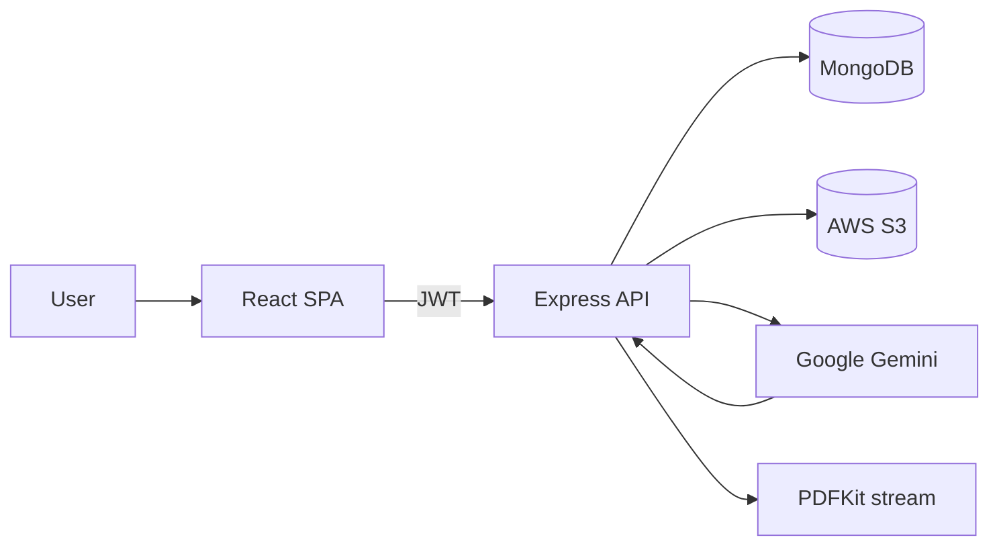
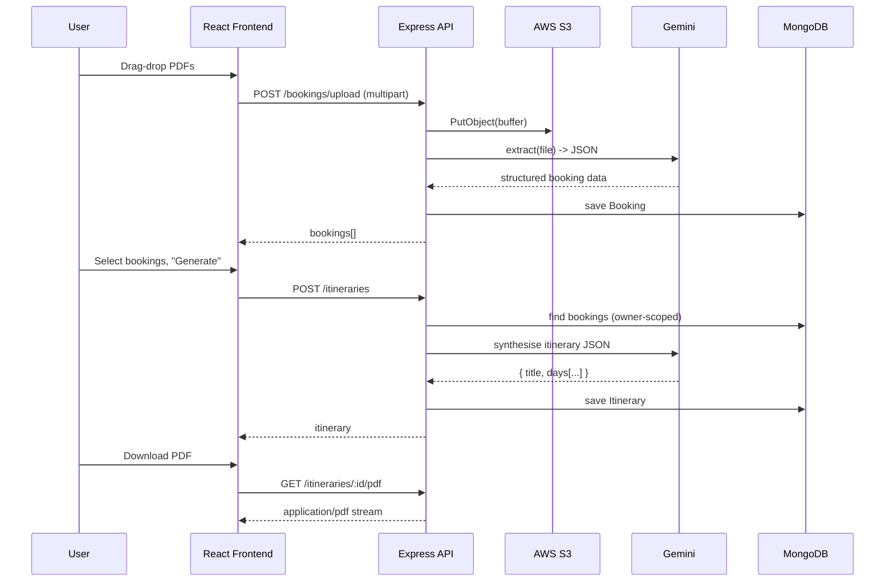
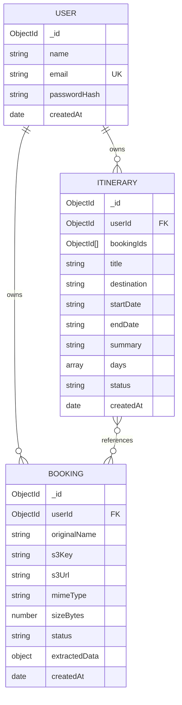

# Wanderlog · AI-Powered Travel Itinerary Builder

A production-quality MERN application that turns travel booking documents (flight tickets, hotel
reservations, train tickets, etc.) into a clean, day-by-day itinerary using Google Gemini's
multimodal API. Built as the take-home assignment for the Junior Full Stack Developer (MERN + AI)
role at Orbitra Technologies.

## Highlights

- **JWT authentication** with bcrypt password hashing and rate-limited auth routes.
- **Drag-and-drop uploads** for PDFs and images, with per-file extraction status badges.
- **AWS S3** storage for uploaded documents (server-side encryption, scoped per user).
- **Gemini 1.5 Flash** multimodal extraction parses each document into structured JSON.
- **Gemini 1.5 Pro** synthesises a chronological itinerary from all selected bookings.
- **MongoDB + Mongoose** for users, bookings, and itineraries with proper indexes and ownership filtering.
- **PDF export** of any itinerary using PDFKit, streamed via the API.
- **TypeScript end-to-end** with Zod validation on every API boundary.
- **Beautiful, responsive UI** built with React, Tailwind CSS, and shadcn-style primitives.

## Tech Stack

| Layer | Stack |
| --- | --- |
| Frontend | Vite, React 18, TypeScript, Tailwind CSS, shadcn/ui patterns, React Router, TanStack Query, React Hook Form + Zod, react-dropzone, Zustand, sonner |
| Backend | Node.js, Express, TypeScript, Mongoose, JWT, Multer, Helmet, express-rate-limit, Pino |
| AI / Storage | Google Gemini (`@google/generative-ai`), AWS S3 (`@aws-sdk/client-s3`), PDFKit |
| Database | MongoDB |

## Repository Layout

```
ai-powered-itinerary/
├── backend/                 # Express + TypeScript API
│   └── src/
│       ├── config/          # env, db, s3, gemini clients
│       ├── controllers/     # thin HTTP layer
│       ├── middleware/      # auth, errorHandler, upload, validate, rate limiters
│       ├── models/          # User, Booking, Itinerary
│       ├── routes/          # express routers
│       ├── services/        # auth, extraction, itinerary, pdf, storage
│       └── utils/           # logger, asyncHandler, tokens, ApiError
├── frontend/                # Vite + React + TypeScript SPA
│   └── src/
│       ├── components/      # ui/, layout/, upload/, BookingCard, BookingTypeIcon
│       ├── hooks/           # useAuth, useBookings, useItineraries
│       ├── lib/             # api client, queryClient, utils
│       ├── pages/           # Login, Register, Dashboard, Upload, History, ItineraryDetail
│       ├── routes/          # ProtectedRoute
│       └── store/           # Zustand auth store
└── package.json             # `concurrently` dev script for both packages
```

## Architecture



End-to-end flow for itinerary creation:



## Getting Started

### Prerequisites

- Node.js 18.18+ (Node 20 LTS recommended)
- MongoDB running locally, or a MongoDB Atlas connection string
- A Google Gemini API key — get one at <https://aistudio.google.com/app/apikey>
- An AWS account with an S3 bucket and access keys (see IAM policy below)

### Install

From the repo root:

```bash
npm install
npm --prefix backend install
npm --prefix frontend install
```

Or, as a shortcut:

```bash
npm run install:all
```

### Configure environment

Copy the example files and fill in the values:

```bash
cp backend/.env.example backend/.env
cp frontend/.env.example frontend/.env
```

`backend/.env` keys:

| Variable | Description |
| --- | --- |
| `PORT` | API port (default `5000`) |
| `NODE_ENV` | `development` / `production` |
| `CLIENT_ORIGIN` | Frontend origin for CORS (default `http://localhost:5173`) |
| `MONGODB_URI` | Mongo connection string |
| `JWT_SECRET` | Long random string (16+ chars) |
| `JWT_EXPIRES_IN` | e.g. `7d` |
| `GEMINI_API_KEY` | Google AI Studio API key |
| `GEMINI_EXTRACTION_MODEL` | default `gemini-1.5-flash` |
| `GEMINI_ITINERARY_MODEL` | default `gemini-1.5-pro` |
| `AWS_REGION`, `AWS_ACCESS_KEY_ID`, `AWS_SECRET_ACCESS_KEY` | S3 credentials |
| `S3_BUCKET` | Target bucket name |
| `MAX_FILE_SIZE_MB`, `MAX_FILES_PER_UPLOAD` | Upload limits |

`frontend/.env`:

| Variable | Description |
| --- | --- |
| `VITE_API_URL` | API base URL, default `http://localhost:5000/api` |

### Run in development

```bash
npm run dev
```

This starts the backend (`tsx watch`) on `http://localhost:5000` and the frontend (`vite`) on
`http://localhost:5173`, with API requests proxied from Vite during dev.

### Production build

```bash
npm run build
npm start            # serves the compiled backend
# Frontend production assets are emitted to frontend/dist
```

## AWS S3 IAM Policy

A minimal IAM policy for the access key used by the backend:

```json
{
  "Version": "2012-10-17",
  "Statement": [
    {
      "Effect": "Allow",
      "Action": ["s3:PutObject", "s3:GetObject", "s3:DeleteObject"],
      "Resource": "arn:aws:s3:::YOUR_BUCKET_NAME/*"
    }
  ]
}
```

Objects are stored under `users/<userId>/<uuid>-<filename>` with `ServerSideEncryption: AES256`.

## API Reference

All endpoints are prefixed with `/api`. Protected endpoints require `Authorization: Bearer <token>`.

| Method | Path | Auth | Description |
| --- | --- | --- | --- |
| `GET`  | `/health` |  – | Liveness probe |
| `POST` | `/auth/register` | – | Create account, returns `{ user, token }` |
| `POST` | `/auth/login` | – | Returns `{ user, token }` |
| `GET`  | `/auth/me` | ✓ | Current user |
| `GET`  | `/bookings` | ✓ | List user's bookings |
| `POST` | `/bookings/upload` | ✓ | Multipart `files[]`, uploads to S3 + parses |
| `DELETE` | `/bookings/:id` | ✓ | Delete a booking (and S3 object) |
| `GET`  | `/itineraries` | ✓ | List user's itineraries |
| `POST` | `/itineraries` | ✓ | Body `{ bookingIds[], title? }` — AI-generated |
| `GET`  | `/itineraries/:id` | ✓ | Get one itinerary |
| `DELETE` | `/itineraries/:id` | ✓ | Delete itinerary |
| `GET` | `/itineraries/:id/pdf` | ✓ | Download itinerary as PDF |

Error responses use a consistent envelope:

```json
{
  "error": {
    "code": "BAD_REQUEST",
    "message": "Human-readable message",
    "details": { "field": ["why"] }
  }
}
```

## Data Model



## Security Notes

- Passwords hashed with `bcryptjs` (10 rounds) — only the hash is ever stored.
- JWTs signed with `JWT_SECRET`, default 7-day expiry.
- Every user-scoped query filters by `req.user.id`; ownership is enforced server-side.
- `helmet` + CORS whitelist; auth and upload routes are rate-limited.
- Multer uses in-memory storage with a strict mime allowlist (PDF/JPG/PNG/WebP) and configurable size limits.
- All API inputs validated with Zod before reaching controllers.

## Mapping to the Evaluation Criteria

| Criterion | Where to look |
| --- | --- |
| Code quality | TypeScript end-to-end, Zod validation, central error envelope, services/controllers separation |
| Folder structure | `backend/src/{config,controllers,middleware,models,routes,services,utils}`, `frontend/src/{components,hooks,lib,pages,routes,store}` |
| Backend architecture | Layered: routes → controllers → services → models; cross-cutting middleware (auth, validate, errorHandler, rate limit) |
| API design | REST, ownership-scoped, consistent envelope, pluralised resources, semantic verbs |
| Database structure | Indexed `userId` + `createdAt` on Booking/Itinerary, unique email, sub-document schemas for `extractedData` and `days[].items[]` |
| UI/UX quality | Drag-drop, optimistic toasts, live extraction badges, dark-mode-ready theme, responsive nav, timeline detail |
| Problem-solving | Multimodal Gemini call avoids OCR stack; JSON-mode + Zod fallback for resilience; sticky “Generate” CTA |
| Product thinking | Recent-itinerary dashboard, PDF export, friendly empty states, copy-able destination/dates, mobile bottom nav |

## Bonus Features Implemented

- AWS S3 integration with per-user object scoping and SSE-AES256.
- Drag-and-drop multi-file uploads with previews and per-file status.
- shadcn-style design system + gradient backgrounds, light/dark variables, mobile-first layout.
- PDF export for offline sharing.

## Possible Next Steps

- Background job queue (BullMQ) so very large PDFs don't block the request thread.
- Public, tokenised share links with view-only itinerary pages.
- Per-day cover images via Gemini text-to-image or Unsplash.
- Calendar (.ics) export.

## License

MIT — assignment submission for Orbitra Technologies.
